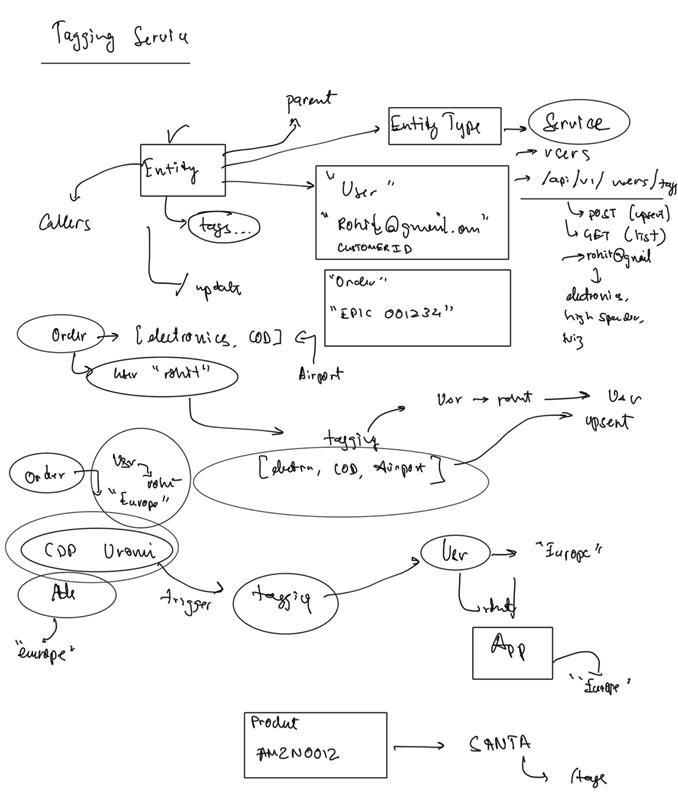

## Tagging Service
### Its a centralized service which will store tags from all other microservices.

Following are the tasks it should perform.

    1. Register applications (Microservices).
       1) Application will have id and a callback url(webhook) .
       2) Only registered applications can send tags.

    2.Receive tags from applications. Tags are stored against an entity.
      1) Entity could be anything -- user, product, screen etc.
      2) Tags also stores which services have added/modified that entity.

    3.Notify concerned applications about the update.
      1) When some application updates tags for an entity.
      2) All the applications connected to that entity must be informed to their callback url.

#### Note:
* Assume applications will have a valid endpoint to receive the webhook on registered url.
* Assume on tag add/modify request applications will send the app_id in the header for identification.
